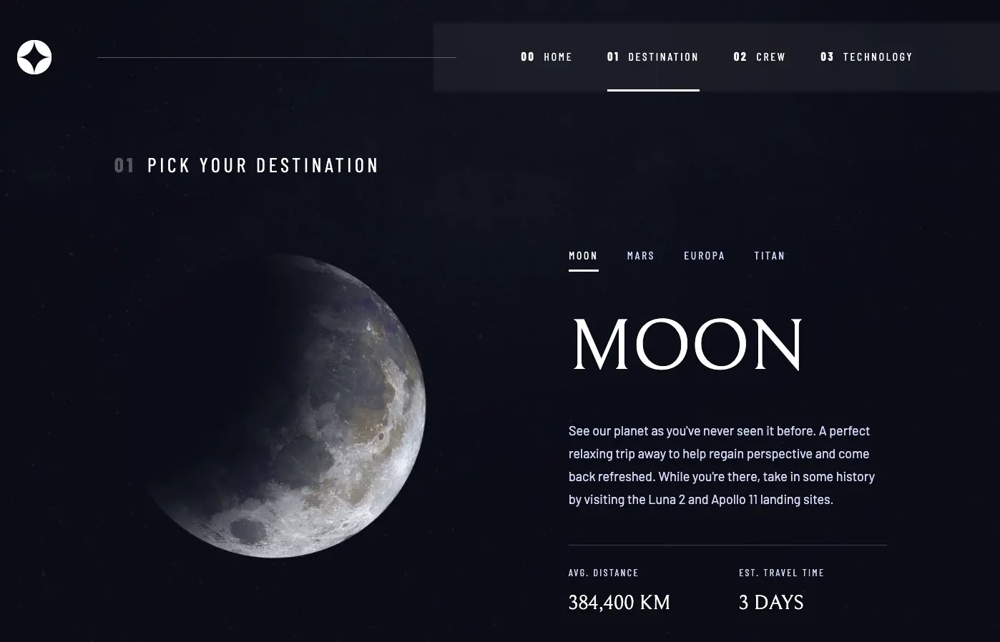

# Space Tourism Website - Remix Implementation


## Overview

This is my solution to the [Space tourism website challenge on Frontend Mentor](https://www.frontendmentor.io/challenges/space-tourism-multipage-website-gRWj1URZ3). The project is a multi-page website for a fictional space tourism company, featuring information about space destinations, crew members, and technology.

### [Live Demo](https://space-tourism-frontend-mentor-challenge.vercel.app/)

## Features

- **Responsive Design**: Optimized layouts for mobile, tablet, and desktop viewports
- **Interactive Elements**: Tab-based navigation, dot sliders, numbered navigation
- **Modern UI**: Implementing the Figma design with pixel-perfect accuracy
- **Accessibility**: Semantic HTML structure and ARIA attributes for screen readers
- **Performance Optimized**: Image optimization and responsive loading strategies

## Built with

- [Remix](https://remix.run/) - Full stack React framework
- [TypeScript](https://www.typescriptlang.org/) - Typed JavaScript
- [Tailwind CSS](https://tailwindcss.com/) - Utility-first CSS framework
- [React](https://reactjs.org/) - JavaScript library for user interfaces
- Semantic HTML5 markup
- CSS Flexbox and Grid
- Mobile-first workflow

## Project Structure

The project follows a well-organized structure:

```
project-root/
├── app/
│   ├── components/         # Shared components
│   ├── routes/             # Remix routes for each page
│   ├── types/              # TypeScript interfaces
│   └── utils/              # Helper functions
├── public/                 # Static assets
└── ...
```

For a detailed explanation of the project structure, see [PROJECT_STRUCTURE.md](./PROJECT_STRUCTURE.md).

## Screenshots

### Home Page


### Destination Page



### Crew Page


### Technology Page


## Getting Started

### Prerequisites

- Node.js v14+ and npm

### Installation

1. Clone the repository

   ```bash
   git clone https://github.com/JohnPugh688/space-tourism-frontend-mentor-challenge.git
   cd space-tourism-frontend-mentor-challenge
   ```

2. Install dependencies

   ```bash
   npm install
   ```

3. Start the development server

   ```bash
   npm run dev
   ```

4. Open [http://localhost:3000](http://localhost:3000) to view it in the browser

### Building for production

```bash
npm run build
```

## Key Implementation Details

### Responsive Design System

- Mobile-first approach with breakpoints at 768px (tablet) and 1024px (desktop)
- Consistent spacing system throughout the application
- Flexible layouts that adapt to different screen sizes

### Component Architecture

- Reusable components for common UI elements
- Shared background image component with responsive options
- Error boundary components for graceful error handling

### Navigation Patterns

- Tab-based navigation for destinations
- Dot slider for crew members
- Numbered navigation for technology items

### Accessibility Features

- Semantic HTML structure
- ARIA attributes for interactive elements
- Keyboard navigation support
- Proper heading hierarchy

## What I Learned

This project provided valuable experience in:

- Implementing complex UI designs with Remix and Tailwind
- Building responsive layouts that work across multiple device sizes
- Creating accessible navigation patterns
- Handling image optimization for different screen sizes
- Structuring a Remix project for scalability and maintainability

## Future Enhancements

- Add animations for smoother page transitions
- Implement a dark/light mode toggle
- Add unit and integration tests
- Improve performance with advanced image optimization techniques

## Author

- GitHub - [JohnPugh688](https://github.com/JohnPugh688)
- Frontend Mentor - [@JohnPugh688](https://www.frontendmentor.io/profile/JohnPugh688)

## Acknowledgments

- [Frontend Mentor](https://www.frontendmentor.io) for providing the challenge
- [Remix](https://remix.run/) team for the amazing framework

---

This project was implemented as a portfolio piece to demonstrate skills in modern web development.
